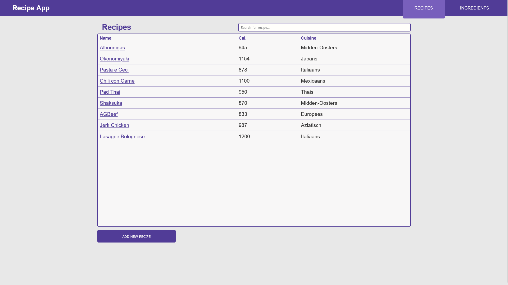
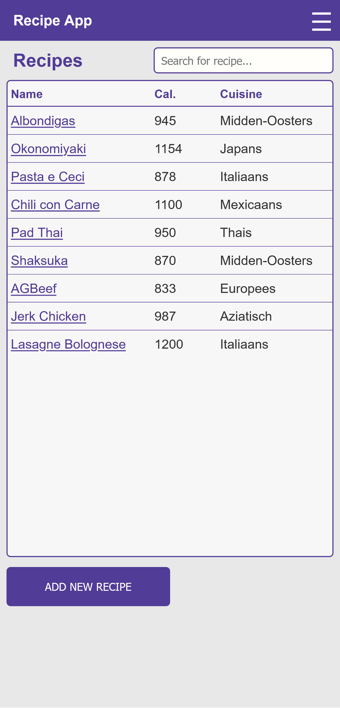
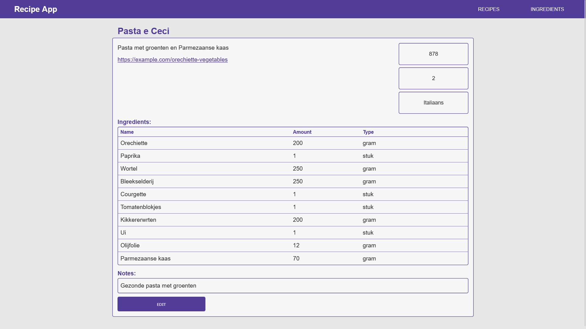
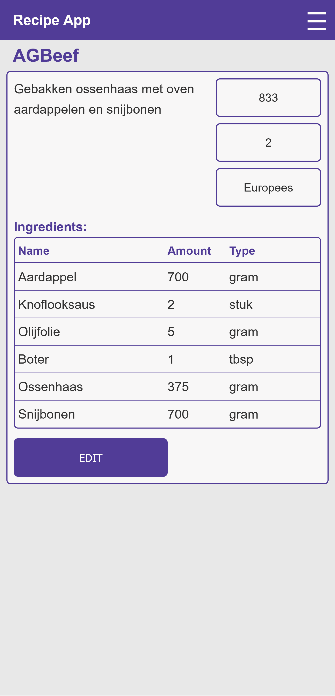
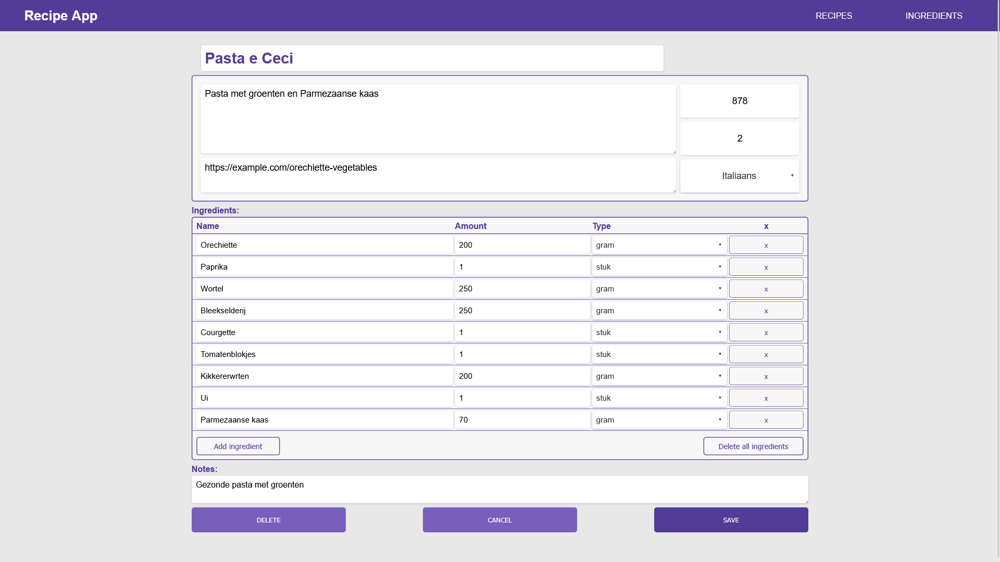
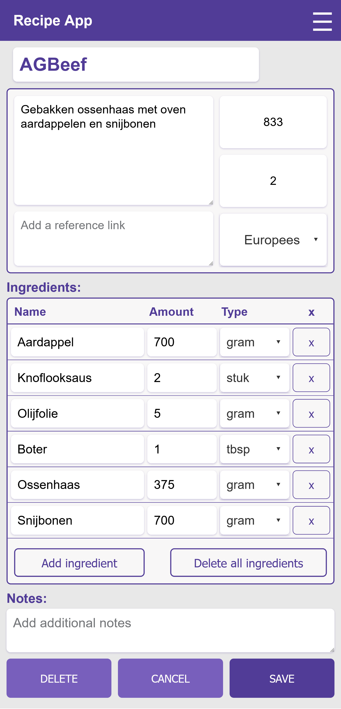

# Recipe App

> A personal recipe application that helps store recipes, track ingredients and provide instructions.

## About

An application to keep track of your favorite recipes, with personalized information like calories, cuisine types, and ingredients. Built as a standalone solution, without the external need for depedencies or subscriptions.
It is designed to eventually expand into a meal planning tool with automatic grocery list generation.

I developed this project to advance my front-end development skills, focusing on React and modern web development practices. While I handled all the front-end development, I collaborated closely with a backend developer on database design and API architecture, giving me valuable insight into full-stack development workflows and cross-team collaboration.

## Screenshots

| Desktop View | Mobile View |
|--------------|-------------|
|| 
|| 
|| 
|[Web Ingredients](./screenshots/WebIngredientList.png)| [Mobile Ingredients](./screenshots/MobileIngredientList.png)
|[Web Recipe Edit](./screenshots/WebRecipeEdit.png)| [Mobile Recipe Edit](./screenshots/MobileRecipeEdit.png)
|[Web Empty Recipe](./screenshots/WebEmptyRecipe.png)| [Mobile Nav bar](./screenshots/MobileNavBar.png) |
|[Web Modal](./screenshots/WebDeleteRecipe.png)| [Mobile Modal](./screenshots/MobileDeleteRecipe.png)
| | [Mobile Used in Display](./screenshots/MobileUsedInDisplay.png)

## Features

- 🔍 Search recipes by name
- 📝 Create and edit and delete custom recipes
- 🛒 Tracks all ingredients used in recipes
- 📱 Responsive design for mobile and desktop

## Tech Stack

**Frontend:**
- React
- Node.js
- HTML/CSS

**Backend:**
- Kotlin
- Springboot
- Database (MySQL)

**Tools & Services:**
- Recipe API (custom)
- Testing (Cypress)
- Deployment (Docker)
- Version Control (Git/GitHub)

## What I Learned

### Technical Skills
- **React**: Learned complex states for recipe data and useContext for confirmation dialogs
- **API Integration:** Learned to work with recipe APIs, handling data requests and transformation
- **UI & Design:** Implemented a clear but visually pleasing design, with expected visual feedback and functionality across elements
- **Responsive Design:** Made the application usable on different desktop and mobile devices

## Challenges Overcome
- **State Management:** Implementing confirmation dialogs across multiple components without prop drilling
- **API Design:** Collaborating on backend structure while learning how frontend needs translate to database design
- **Components:** Different custom and reusable components to be used throughout the application
- **Testing:** Learned how to do end-to-end testing and applied it to this project

## Future Enhancements

**Core Features:**
- [ ] Meal planning calendar
- [ ] Grocery list for planned meals
- [ ] Recipe categorization by cuisine or main ingredient
- [ ] Random meal suggestion
- [ ] Recipe scaling and portion adjustment

**User Experience:**
- [ ] Sorting and filtering on recipes and ingredients
- [ ] Reordering ingredients inside a recipe

**Data Management:**
- [ ] Merge and delete functionality for global ingredients
- [ ] Add cuisines or amount types in the application itself

**Technical Functionality:**
- [ ] Custom alert context

